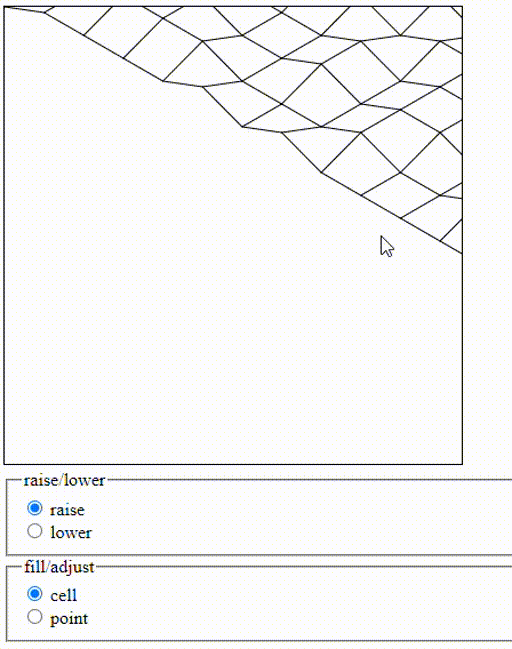

This is a casual attempt to make an isometric game / game engine.

I'm deliberately trying to discover these things myself. I.e. I want to enjoy making the thing not just try to make it as quickly as possible.

This basically is a grid of points and then a grid of cells, rendered onto an html canvas. Each cell can have its height adjusted. There is click handling to calculate which position the mouse is in when it clicks, and to adjust that cell, triggering a re-render of the canvas.

Ideally I'll keep separate layers for the game engine and specific game things like images / specific interactions with the cells, so that it can be re-usable to make different sorts of things. I also want the rendering algorithms etc to be fairly hidden, so that these can be improved later (they seem to be okay right now, but I suspect a more optimal approach could be found if needed).

## to run

- `npm install`
- `npm run dev`
- spin up a web server to run `index.html` in the browser. e.g. in vscode you could use the extension `LiveServer`

## tasks

some tasks I could could do...

- make consistent the screen position + where the mouse is
- ~~figure out how to properly calculate the cell the mouse is over~~
- add ability to move canvas with right click
- make other canvas objects which sit above/below each other for different renderings, and to be able to make some of them transparent if I feel like it.
- build a little more robust interface to interact with the game thing
- some abstraction for being able to control which images are rendered in cells
- find a way to highlight corners / edges when mouse is over them
- build and animate a vehicle in blender to go into the game
- fix the thing with passing around Grid